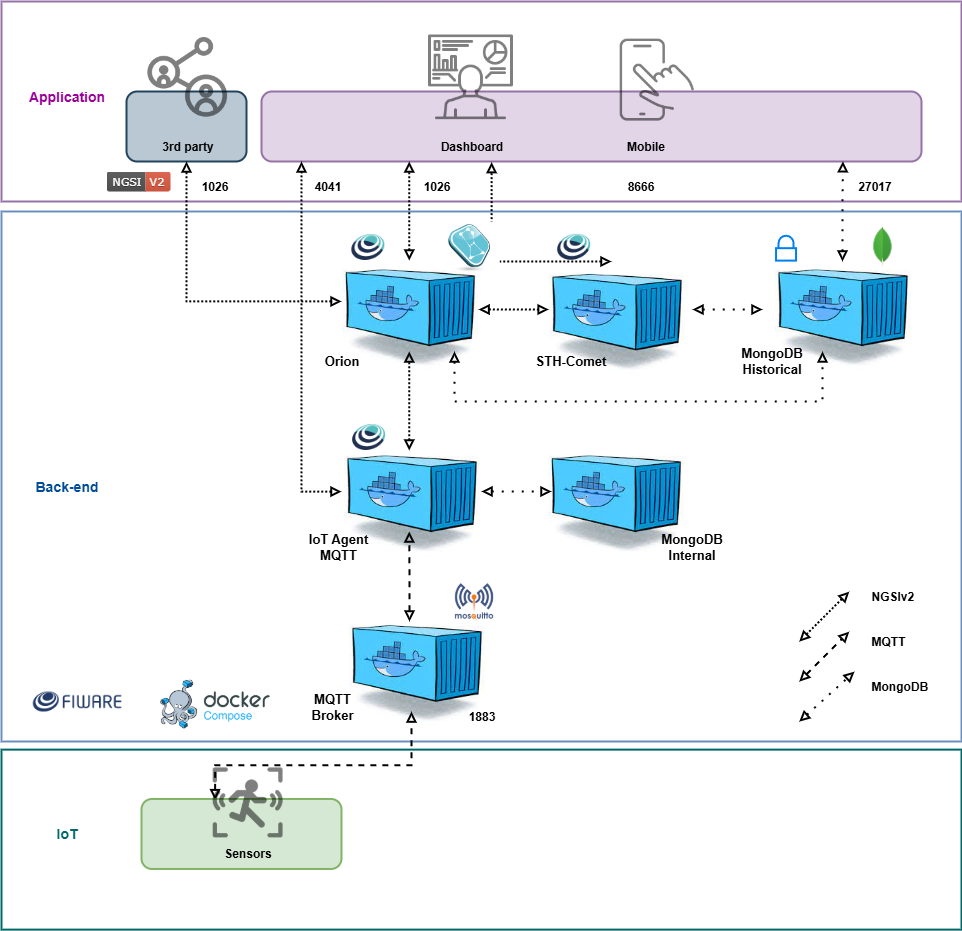

# Passa a Bola — Monitor de Campo (Temperatura & Umidade) com FIWARE

Projeto da equipe **Zetta Works** para **monitorar em tempo real a temperatura e a umidade do gramado/quadra**, ajudando a decidir **melhor horário de jogo, irrigação e manutenção**.  
Os dados do sensor **DHT22 + ESP32** são enviados por **MQTT** ao **IoT Agent** e viram uma entidade no **Orion Context Broker** (FIWARE).  
Opcionalmente, armazenamos histórico no **STH-Comet** para gráficos e análises.

---

## Arquitetura

Fluxo padrão **FIWARE NGSI v2**:

1. **ESP32 + DHT22** → publica MQTT (UL 2.0) nos tópicos `/TEF/field001/attrs/t` e `/TEF/field001/attrs/h`.  
2. **IoT Agent MQTT** (porta `4041`) mapeia `t→temperature` e `h→humidity` e cria/atualiza a entidade **`urn:ngsi-ld:Field:field001`** (type `SoccerField`) no **Orion** (porta `1026`).  
3. (**Opcional**) **STH-Comet** (porta `8666`) recebe notificações e guarda histórico para consultas e dashboard.



```text
[DHT22+ESP32] --MQTT--> [IoT Agent] --NGSI v2--> [Orion] --notify--> [STH-Comet]
```

---

## Hardware

| Componente | Função | ESP32 |
|---|---|---|
| **DHT22** | Temperatura (°C) e Umidade (%) | **GPIO 4 (DATA)**, 3V3, GND |
| *(Opcional)* LED | Indicador local | GPIO 2 |

> Este projeto foca **somente** em temperatura e umidade (sem LDR/luminosidade).

---

## Faixas de referência (sugestão)

| Parâmetro | Faixa alvo | Observação |
|---|---|---|
| Temperatura | **15–26 °C** | conforto/segurança para prática esportiva |
| Umidade | **40–70 %** | influência no gramado e sensação térmica |

> Ajuste os limites à realidade da sua região/time.

---

## Software e Ferramentas

- **ESP32 + Arduino IDE (.ino)**
  - Publica MQTT (UL 2.0) para o **IoT Agent**:
    - `/TEF/field001/attrs/t` → temperatura (número)
    - `/TEF/field001/attrs/h` → umidade (número)
- **FIWARE (Docker Compose)**
  - **Orion Context Broker** (`1026`)
  - **IoT Agent MQTT** (`4041`)
  - **Mosquitto** (`1883`)
  - **MongoDB**
  - **STH-Comet** (`8666`) *(opcional para histórico)*
- **Postman**
  - Coleção com: Health Check, Service Group, Devices, Subscriptions e Consultas.

---

## Provisionamento (Postman)

1. **Health check do IoT Agent**  
   `GET http://{{url}}:4041/iot/about`

2. **Criar Service Group** (`apikey=TEF`, `resource=/TEF`)  
   `POST http://{{url}}:4041/iot/services`

3. **Registrar dispositivo** (device_id `field001`, type `SoccerField`)  
   `POST http://{{url}}:4041/iot/devices`
   ```json
   {
     "devices": [{
       "device_id": "field001",
       "entity_name": "urn:ngsi-ld:Field:field001",
       "entity_type": "SoccerField",
       "protocol": "PDI-IoTA-UltraLight",
       "transport": "MQTT",
       "attributes": [
         { "object_id": "t", "name": "temperature", "type": "Number" },
         { "object_id": "h", "name": "humidity",    "type": "Number" }
       ]
     }]
   }
   ```

4. **(Opcional) Assinar histórico no STH-Comet**  
   `POST http://{{url}}:1026/v2/subscriptions`  
   Corpo (exemplo):
   ```json
   {
     "description": "Histórico de temperatura e umidade",
     "subject": {
       "entities": [{ "id": "urn:ngsi-ld:Field:field001", "type": "SoccerField" }],
       "condition": { "attrs": ["temperature", "humidity"] }
     },
     "notification": {
       "http": { "url": "http://{{url}}:8666/notify" },
       "attrs": ["temperature", "humidity"],
       "attrsFormat": "legacy"
     }
   }
   ```

5. **Consultar valores atuais (keyValues)**  
   ```text
   GET http://{{url}}:1026/v2/entities\?id=urn:ngsi-ld:Field:field001&type=SoccerField&options=keyValues
   ```

6. **Consultar histórico (últimos N)**  
   - Temperatura:  
     ```text
     GET http://{{url}}:8666/STH/v1/contextEntities/type/SoccerField/id/urn:ngsi-ld:Field:field001/attributes/temperature?lastN=30
     ```
   - Umidade:  
     ```text
     GET http://{{url}}:8666/STH/v1/contextEntities/type/SoccerField/id/urn:ngsi-ld:Field:field001/attributes/humidity?lastN=30
     ```

---

## Código (ESP32)

- Publique a cada X segundos (ex.: `5s`) os valores do DHT22:  
  - `t` = temperatura (número) → `/TEF/field001/attrs/t`  
  - `h` = umidade (número)     → `/TEF/field001/attrs/h`  
- **Formato UL 2.0**: apenas o **valor** em texto (ex.: `"26.4"`).


---

## Execução

1. **Subir FIWARE (Docker Compose)**  
   ```bash
   docker compose up -d
   ```
2. **Provisionar via Postman** (ordem acima).  
3. **Fazer upload do .ino** no ESP32 (Serial 115200).  
4. **Validar no Orion** (GET keyValues).  
5. **(Opcional) Ver histórico no STH-Comet** (GET lastN).

---

## Dashboard / Visualização (opcional)

Consuma o histórico do STH-Comet em um app Python (Flask/Plotly/Dash) ou outro front-end e exiba:
- Série temporal de **temperatura** e **umidade**;  
- **Faixas de referência** destacadas;  
- Indicadores “no ponto / fora da faixa”.

---

## Evidências e recursos

- **Coleção Postman:** `./Postman/DHT_FIWARE.postman_collection.json`  
- **Wokwi (DHT22+ESP32):** adicione o link do seu projeto  
- **Repositório:** adicione o link do GitHub do time

---

